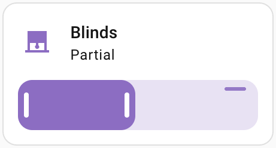

# Home Assistant TDBU Widget

A custom Lovelace card that controls top-down bottom-up blinds using two cover entities (top rail and bottom rail) in a single dual-handle slider.

## Features
- Dual-handle slider representing the fabric between top and bottom rails.
- Compact preview for dashboards with tap-to-open detail view.
- Drag, click-to-set, and keyboard control (arrow keys, shift for 5x step).
- Works with standard `cover.set_cover_position` service calls.
- Includes a visual UI editor in Lovelace (no YAML required).

## Preview
| Standard cover | TDBU dual-rail |
| --- | --- |
|  |  |

## Installation

### HACS (Custom Repository)
1. Add this repository to HACS as a custom frontend repository.
2. Install the card.
3. In Home Assistant, go to **Settings → Dashboards → Resources** and add:
   - URL: `/hacsfiles/ha-tdbu-widget/ha-tdbu-widget.js`
   - Type: `JavaScript Module`

### Manual
1. Copy `ha-tdbu-widget.js` to your Home Assistant `config/www/` folder.
2. Add the resource:
   - URL: `/local/ha-tdbu-widget.js`
   - Type: `JavaScript Module`
3. Alternative: auto-load for all dashboards by adding to `configuration.yaml`:
   ```yaml
   frontend:
     extra_module_url:
       - /local/ha-tdbu-widget.js
   ```

## Configuration
You can configure the card in the UI editor or via YAML.

```yaml
type: custom:ha-tdbu-widget
top_entity: cover.living_room_blind_top
bottom_entity: cover.living_room_blind_bottom
name: Living Room Blind
top_side: right
show_positions: false
show_indicator: false
show_positions_dialog: true
tap_action: details
step: 1
min_gap: 0
```

### Options
- `top_entity` (required): Entity ID for the top rail cover.
- `bottom_entity` (required): Entity ID for the bottom rail cover.
- `name` (optional): Card title override.
- `top_side` (optional, default: `right`): Which side of the horizontal slider represents the top rail (`left` or `right`).
- `show_positions` (optional, default: `false`): Show top/bottom percent values on the tile.
- `show_indicator` (optional, default: `false`): Show a small visual indicator on the tile for which side is the top rail.
- `show_positions_dialog` (optional, default: `true`): Show top/bottom percent values in the dialog.
- `tap_action` (optional, default: `details`): `details` | `more-info` | `none`.
- `tap_entity` (optional): Entity ID to open when `tap_action: more-info`.
- `step` (optional, default: `1`): Percent step for keyboard adjustments.
- `min_gap` (optional, default: `0`): Minimum gap between rails (percent).

## Notes
- The top handle maps to `current_position` on the top cover entity (0 = top, 100 = bottom).
- The bottom handle maps to `current_position` on the bottom cover entity (0 = bottom, 100 = top).
- The shaded area represents the fabric between the two rails.

## Development
This card is a single JS module. No build step is required.

## Support
If you run into issues, open an issue with your entity states and a short video or screenshot showing the behavior.
